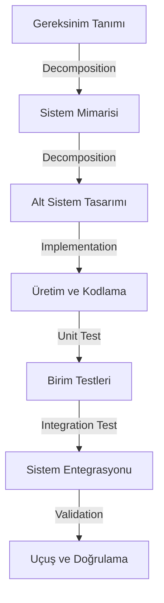
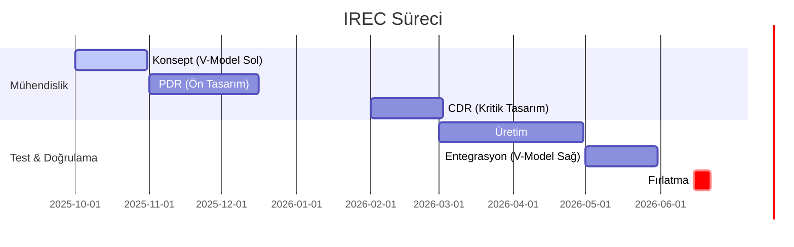

# 🚀 PROXIMA GÖREVİ | Spaceport America Cup Teknik Bilgi Bankası


   

> [!IMPORTANT]
> **MÜHENDİSLİK DİSİPLİNİ UYARISI:**
> Bu repo, sadece roket "yapanlar" için değil, roket "mühendisliği" yapanlar içindir.
> Kodlar ve simülasyon çıktıları ayrı depolanır. Burası **Know-How** merkezidir.

```text
--------------------------------------------------------------------------------
| MISSION CONTROL STATUS   | [ONLINE]  | SYSTEM TIME: T-MINUS 180 DAYS         |
--------------------------------------------------------------------------------
| PROPULSION : [NOMINAL]   | AVIONICS  : [STANDBY]  | STRUCTURES : [GO]        |
| RECOVERY   : [CHECKING]  | PAYLOAD   : [DESIGN]   | WEATHER    : [CLEAR]     |
--------------------------------------------------------------------------------
| LATEST TELEMETRY: Apogee Target Locked @ 10,000 ft AGL / Max Vel: Mach 0.85  |
--------------------------------------------------------------------------------
```

---

## 📚 İçindekiler (Table of Contents)
1.  [Görev Tanımı](#-görev-tanımı)
2.  [Organizasyon Hakkında: ESRA & IREC](#-organizasyon-hakkında-esra--irec-nedir)
3.  [Gelecek Vizyonu (Roadmap)](#-gelecek-vizyonu-roadmap)
4.  [Sistem Mühendisliği Yaklaşımı (V-Model)](#-sistem-mühendisliği-v-modeli-yaklaşımı)
5.  [Uçuş Dinamiği ve Monte Carlo Analizleri](#-uçuş-dinamiği-ve-monte-carlo-analizleri)
6.  [Spaceport America Cup: Derinlemesine Bakış](#-spaceport-america-cup-derinlemesine-bakış)
7.  [Yazılım Mimarisi (Safety Critical)](#-yazılım-mimarisi-safety-critical)
8.  [Launch Day Ops: Saat Saat Operasyon](#-launch-day-ops-saat-saat-operasyon)
9.  [Sahada Yaşam Rehberi: Isı, Toz ve Yılanlar](#-sahada-yaşam-rehberi-ısı-toz-ve-yılanlar)
10. [Alt Sistemler ve Bilgi Portalı](#-alt-sistemler-ve-bilgi-portalı)

---

## 🚀 Launch Day Ops: Saat Saat Operasyon
Fırlatma günü kaos değil, sanattır. İşte operasyon planımız:

```mermaid
timeline
    title L-0 Launch Day Timeline
    05:00 : Uyanış & Kahvaltı (Bol Su!)
          : Rampa Alanına Hareket
    06:00 : Pad Setup & Rail Alignment
          : Motor Montajı (On-site Assembly)
    08:00 : LCO (Launch Control Officer) Check-in
          : Aviyonik Power-Up & Ses Testi
    09:00 : Roketin Rampaya Yüklenmesi
          : Continuity Check (Ateşleyici Testi)
    10:00 : GO FOR LAUNCH! 🚀
    10:15 : Kurtarma Ekibi Hareketi (Recovery Tracking)
    12:00 : Roket İncelemesi & Veri İndirme (Post-Flight)
```

---

## 🌌 Görev Tanımı
> *"We choose to go to the moon not because it is easy, but because it is hard."* - J.F. Kennedy

**KTU Gökçen Roket Takımı**, Spaceport America Cup için **sistem güvenilirliği (reliability)** ve **uçuş kesinliği (precision)** odaklı bir mühendislik kültürü benimser. "Deneme-Yanılma" değil, "Analiz Et-Simüle Et-Doğrula" (Analyze-Simulate-Verify) prensibiyle çalışırız.

---

## 🏛️ Organizasyon Hakkında: ESRA & IREC Nedir?
Bu proje, sıradan bir roket fırlatma etkinliği değil, küresel bir mühendislik meydan okumasıdır.

### 🇺🇸 ESRA (Experimental Sounding Rocket Association)
2003 yılında kurulan **ESRA**, gelecek nesil havacılık ve uzay mühendislerini yetiştirmeyi amaçlayan, ABD merkezli, kar amacı gütmeyen (Non-profit) bir kuruluştur. Boeing, Blue Origin ve Virgin Galactic gibi devlerin desteğiyle, akademik teori ile saha operasyonları arasındaki boşluğu doldurur.

### 🏆 IREC (Spaceport America Cup)
Dünyanın en büyük üniversiteler arası roket mühendisliği yarışmasıdır.
*   **Konum:** Spaceport America, New Mexico (Dünyanın ilk ticari uzay limanı).
*   **Ölçek:** 6 kıtadan, 24 ülkeden 150'den fazla üniversite takımı.
*   **Amaç:** 10,000 ft veya 30,000 ft irtifaya hassas bir şekilde ulaşabilen, bilimsel faydalı yük taşıyan ve tamamen öğrenci tasarımı (SRAD) roket sistemleri geliştirmek.
*   **Prestij:** Bu yarışma, "Roketçiliğin Olimpiyatları" olarak kabul edilir.

---

## 🗺️ Gelecek Vizyonu (Roadmap)
Bu takım nereye gidiyor? 2025 ve ötesi için planlarımız:
*   [Yol Haritasını Görüntüle (ROADMAP.md)](ROADMAP.md)
*   **Q1 2025:** PDR Tamamlanması & Avionics Bench Testleri.
*   **Q2 2025:** SRAD Hibrit Motor Statik Ateşleme.
*   **Q2 2026:** Spaceport America Cup 30k Atışı.

---

## 📐 Sistem Mühendisliği: "V-Modeli" Yaklaşımı
Gökçen Takımı, NASA standartlarında "V-Model" yaşam döngüsünü uygular.



*   **Sol Kol (Tasarım):** "Doğru roketi mi tasarlıyoruz?" (Validation).
*   **Sağ Kol (Test):** "Roketi doğru mu ürettik?" (Verification).
*   **Traceability:** Her vida, her kod satırı bir **SRD (System Requirement Document)** maddesine dayanmalıdır. *"Canımız istedi diye parça eklemiyoruz."*

---

## 📈 Uçuş Dinamiği ve Monte Carlo Analizleri
Roketimiz düz gitmez. Rüzgar, itki sapmaları ve montaj hataları kaotiktir.

### 1. 6-DOF Hareket Denklemleri (Equations of Motion)
RocketPy veya OpenRocket kullanırken, arka planda şu diferansiyel denklemler çözülür:

<details>
<summary>📐 Denklemleri Görüntüle (Matematiksel Derinlik)</summary>

**Öteleme (Translation - Newton II):**
$$ \Sigma \vec{F} = m \frac{d\vec{v}}{dt} = \vec{F}_{thrust} + \vec{F}_{drag} + \vec{F}_{lift} + \vec{F}_{gravity} $$

**Dönme (Rotation - Euler):**
$$ \Sigma \vec{M} = I \cdot \dot{\vec{\omega}} + \vec{\omega} \times (I \cdot \vec{\omega}) $$
*   $I$: Eylemsizlik momenti tensörü. (Roket yakıt yaktıkça sürekli değişir!)
*   $\vec{\omega}$: Açısal hız vektörü.

</details>

### 2. Monte Carlo Dispersiyon Analizi
Tek bir simülasyon yetersizdir. Olasılıksal (Stokastik) analiz için **1000+ Uçuş** simüle edilir.
*   **Değişkenler:**
    *   Rüzgar Hızı: $\pm 10$ m/s (Gaussian Distribution)
    *   Motor İtkisi: $\pm \%5$ (Üretim hatası)
    *   CD (Sürüklenme Katsayısı): $\pm \%10$
*   **Çıktı (CEP - Circular Error Probable):** Roketin %95 ihtimalle düşeceği elips alanı. Bu alan, yer ekibinin güvenliği için hayati önem taşır.

---

## 💻 Yazılım Mimarisi (Safety Critical)
[📝 Detaylı Yazılım Rehberi için Tıklayın](docs/04_Subsystems_&_Payload/02_Avionics/README.md)

Yazılımımız "Patlamayı Önlemek" üzerine kuruludur.
*   **RTOS (Gerçek Zamanlı İşletim Sistemi):** FreeRTOS kullanarak kritik görevlerin (Apogee algılama) asla gecikmemesi sağlanır.
*   **Kalman Filtresi:** Sensör verisini (IMU + Barometre) "Sensor Fusion" ile birleştirerek gürültüyü yok ederiz.
    *   *Basit Ortalama:* Gecikme yaratır (Lag).
    *   *Kalman:* Geleceği tahmin eder (Predict).
*   **Watchdog Timer:** İşlemci kilitlenirse 10ms içinde sistemi resetler.

---

## 🏜️ Spaceport America Cup: Derinlemesine Bakış
*   **10k/30k Kategorileri:** COTS (Hazır Motor) ve SRAD (Kendi Motorumuz) ayrımı.
*   **Puanlama:** %50 Uçuş (İrtifa doğruluğu), %50 Mühendislik (Rapor kalitesi).
*   **Cezalar:**
    *   Faydalı yük (8.8 lbs) 1 gram eksikse: **-100 Puan**.
    *   Güvenlik ihlali: **Diskalfiye**.

---

## 🛠️ Alt Sistem Mühendisliği (Bilgi Portalı)
Tüm detaylar ilgili klasörlerde:

| Sistem | İçerik | Link |
| :--- | :--- | :--- |
| **🚀 İtki (Propulsion)** | $I_{sp}$ Formülleri, Enjektör $C_d$ hesabı, Statik Test. | [▶️ İncele](docs/04_Subsystems_&_Payload/01_Propulsion/README.md) |
| **📟 Aviyonik (Avionics)** | RTOS, Kalman, 4-Katmanlı PCB, Link Bütçesi. | [▶️ İncele](docs/04_Subsystems_&_Payload/02_Avionics/README.md) |
| **🏗️ Yapısal (Structures)** | Barrowman Denklemleri, Fin Flutter, Vakum İnfüzyon. | [▶️ İncele](docs/04_Subsystems_&_Payload/03_Aerostructures/README.md) |
| **🪂 Kurtarma (Recovery)** | Ejection Charge (Barut) Hesabı, Şok Kordonu Enerjisi. | [▶️ İncele](docs/04_Subsystems_&_Payload/04_Recovery/README.md) |

---

## 📅 Takvim



---

## 🎖️ Görev Rütbeleri (Mission Ranks)
Bu repoya katkı sağlayanlar, başarılarına göre rütbe kazanır:

| Rozet | Rütbe | Gereksinim |
| :---: | :--- | :--- |
|  | **Cadet** | İlk PR'ını (Issue veya Typo fix) gönderenler. |
|  | **Mission Specialist** | Bir alt sistemin (docs/) teknik rehberini tamamlayanlar. |
|  | **Flight Director** | Kritik mühendislik hesaplarını (Monte Carlo, CFD) yapanlar. |
|  | **Legend** | Roketi Spaceport America'da başarıyla uçuran çekirdek ekip. |
