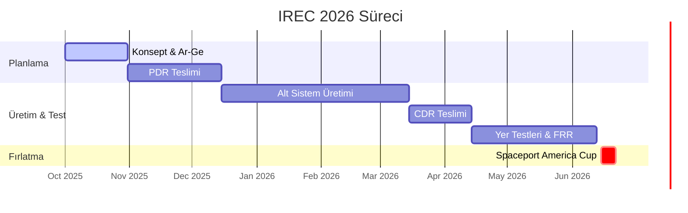

# 🚀 PROXIMA GÖREVİ | Spaceport America Cup Bilgi Bankası

   

> [!IMPORTANT]
> **BU REPO SADECE BİLGİ VE DÖKÜMANTASYON İÇERİR.**
> Burası takımın "Beyni"dir. Kodlar ve simülasyon dosyaları güvenlik gerekçesiyle ayrı repoda tutulur.

---

## 📚 İçindekiler (Table of Contents)
1.  [Görev Tanımı](#-görev-tanımı)
2.  [Spaceport America Cup: Derinlemesine Bakış](#-spaceport-america-cup-derinlemesine-bakış)
3.  [Jüri Puanlama Sırları](#-jüri-puanlama-sırları)
4.  [Ders Alınmış Başarısızlıklar (Learning from Failure)](#-ders-alınmış-başarısızlıklar-learning-from-failure)
5.  [Sahada Yaşam Rehberi: Isı, Toz ve Yılanlar](#-sahada-yaşam-rehberi-ısı-toz-ve-yılanlar)
6.  [Bilgi Portalı & Alt Sistemler](#-bilgi-portalı--alt-sistemler)
7.  [Spaceport Yol Haritası](#-spaceport-yol-haritası)

---

## 🌌 Görev Tanımı
**KTU Gökçen Roket Takımı**, Spaceport America Cup için geliştirdiği roketin tüm teknik birikimini, tasarım kararlarını ve mühendislik hesaplarını burada dökümante eder. Hedefimiz sadece uçmak değil, **mühendislik disiplini** ile uluslararası standartlarda bir sistem ortaya koymaktır.

---

## 🏜️ Spaceport America Cup: Derinlemesine Bakış (Deep Dive)

### Tarihçe ve Önem
2003 yılında kurulan **ESRA (Experimental Sounding Rocket Association)** tarafından düzenlenen bu yarışma, 2006'daki ilk IREC'ten bu yana dünyanın en prestijli roketçilik etkinliğine dönüşmüştür. 2017'den itibaren New Mexico'daki **Spaceport America** (Virgin Galactic'in evi) tesislerinde yapılmaktadır. 2025 itibariyle Teksas Spaceport Midland'a geçiş süreçleri başlamıştır.

### Yarışma Kategorileri
Yarışma sadece "en yükseğe çıkmak" değildir. Aşağıdaki 6 ana kategori mevcuttur:
*   **10k COTS:** 10,000 ft hedef, Hazır motor. (En kalabalık, giriş seviyesi).
*   **10k SRAD:** 10,000 ft hedef, Öğrenci yapımı motor.
*   **30k COTS:** 30,000 ft hedef, Hazır motor.
*   **30k SRAD:** 30,000 ft hedef, Öğrenci yapımı motor. (En prestijli kategorilerden biri).
*   **10k/30k SRAD Hybrid/Liquid:** Hibrit ve sıvı yakıtlı motorlar için özel kategoriler.

---

## ⚖️ Jüri Puanlama Sırları (Scoring Secrets)
Toplam 1000 puan üzerinden değerlendirilirsiniz. İşte "altın vuruş" yapabileceğiniz noktalar:

### 1. Teknik Rapor (400 Puan - %40)
*   En büyük puan kaynağı. Uçuşunuz mükemmel olsa bile raporunuz zayıfsa kazanamazsınız.
*   **AIAA Formatı:** Kesinlikle uyulmalıdır (Yazı tipi, kenar boşlukları, atıflar).
*   **Risk Analizi:** Raporun en çok incelenen kısmıdır. "Ne olursa ne yaparız?" sorusunun cevabı.

### 2. Tasarım & Uygulama (240 Puan - %24)
*   **Poster Sunumu:** Jüri, roketin kendisine değil, sizin onu ne kadar iyi tanıdığınıza bakar.
*   **SRAD Puanları:** Hazır parça yerine kendi tasarımınızı kullanmak (eğer çalışırsa!) ekstra puan getirir.

### 3. Uçuş Performansı (500 Puan Başlangıç)
*   **İrtifa Puanı:** Hedef irtifadan her %1 sapma puan kaybettirir. (9,900 ft, 10,100 ft'ten iyidir).
*   **Kurtarma:** Roket tek parça (veya planlandığı gibi ayrılmış) ve tekrar uçabilir halde inmelidir.

### 🚫 Cezalar (Penalties)
*   **Faydalı Yük İhlali (-100 Puan):** Min. 8.8 lbs (4 kg) kuralı kutsaldır. 1 gram eksik olursa 100 puan silinir.
*   **Güvenlik İhlali (-20 Puan):** Launch rail yanında baretsiz dolaşmak, checklist kullanmamak.

---

## 💥 Ders Alınmış Başarısızlıklar (Common Failure Modes)
Geçmiş yıllarda takımların %40'ı çeşitli sebeplerle diskalifiye olmuş veya başarısız olmuştur.

1.  **Erken Ayrılma (Drag Separation):** Roket ses hızını aşarken oluşan hava direnci, burun konisini vakum etkisiyle çeker. **Shear pins (kesme pimleri)** yeterli değilse paraşüt ses hızında açılır ve roket parçalanır.
2.  **Motor Patlaması (CATO):** Özellikle SRAD motorlarda, grain döküm hataları (hava kabarcığı) yanma yüzeyini aniden artırarak motoru bombaya çevirir.
3.  **Avionik Resetlenmesi:** Yüksek G kuvvetinde pillerin yerinden oynaması. **Çözüm:** Pilleri lehimleyin veya çok sıkı sabitleyin. Asla yaylı pil yuvası kullanmayın!
4.  **Nozzle Blowout:** Grafit kalitesizse veya segman (snap ring) tam oturmadıysa, nozzle fırlatma anında uçar gider.

---

## 🌵 Sahada Yaşam Rehberi: Isı, Toz ve Yılanlar

New Mexico çölü affetmez. Yarışma, hayatta kalma mücadelesidir.

*   **Hidrasyon:** Günde kişi başı **3-4 Galon (12-15 Litre)** su içmelisiniz. Tıbbi ekip en çok susuzluk vakalarına bakar.
*   **Giyim:** Şort giymeyin! Çöl dikenleri ve güneş yanığı için uzun, hafif, UV korumalı pantolon ve uzun kollu tişört şarttır. Geniş kenarlı şapka zorunludur.
*   **Vahşi Yaşam:** Çıngıraklı yılanlar (Rattlesnakes) ve akrepler sahanın gerçek sahipleridir. Asla taşların altına elinizi sokmayın.
*   **Toz Fırtınaları:** İnce çöl tozu (Moon dust) her yere girer. Elektroniklerinizi ve motorunuzu streç filmle koruyun.

---

## 📚 Bilgi Portalı & Alt Sistemler

### 🛠️ Alt Sistem Mühendisliği
| Sistem | İçerik | Link |
| :--- | :--- | :--- |
| **🚀 İtki (Propulsion)** | Motor seçimi, Hibrit motor teorisi, Üretim checklistleri. | [▶️ İncele](docs/04_Subsystems_&_Payload/01_Propulsion/README.md) |
| **📟 Aviyonik (Avionics)** | PCB tasarım kuralları, sensör (BOM) listesi, RF link bütçesi. | [▶️ İncele](docs/04_Subsystems_&_Payload/02_Avionics/README.md) |
| **🏗️ Yapısal (Structures)** | Karbon fiber vs Fiberglass, Fin flutter analizi. | [▶️ İncele](docs/04_Subsystems_&_Payload/03_Aerostructures/README.md) |
| **🪂 Kurtarma (Recovery)** | Paraşüt boyutlandırma, Barut (Black powder) hesapları. | [▶️ İncele](docs/04_Subsystems_&_Payload/04_Recovery/README.md) |

### 📂 Proje Yönetimi
*   **[Yarışma Rehberi (Anayasa)](docs/00_Competition_Guide/README.md)**
*   **[PDR Şablonu](docs/01_Milestones_&_Updates/PDR_Template.md)**
*   **[Teknik Rapor Şablonu](docs/02_Technical_Report/Technical_Report_Template.md)**

---

## 📅 Spaceport Yol Haritası

---
*KTU Gökçen Roket Takımı - Ad Astra Per Aspera*
