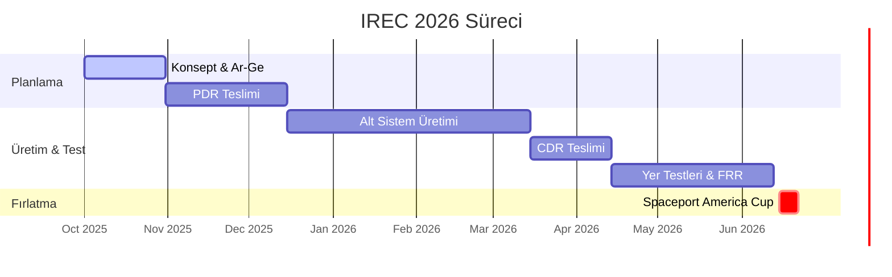

# 🚀 PROXIMA GÖREVİ | Spaceport America Cup Bilgi Bankası

   

> [!IMPORTANT]
> **BU REPO SADECE BİLGİ VE DÖKÜMANTASYON İÇERİR.**
> Uçuş yazılımları, gömülü kodlar ve simülasyon dosyaları ayrı bir repoda tutulmaktadır. Burası takımın "Beyni"dir.

## 🌌 Görev Tanımı
**KTU Gökçen Roket Takımı**, Spaceport America Cup için geliştirdiği roketin tüm teknik birikimini, tasarım kararlarını ve mühendislik hesaplarını burada dökümante eder.

---

## 📚 Bilgi Portalı (Knowledge Portal)

### 📘 [Yarışma Rehberi (Competition Guide)](docs/00_Competition_Guide/README.md)
*   **Anayasa:** Kurallar, Puanlama, Cezalar.
*   **Kategoriler:** 10k/30k, COTS/SRAD farkları.

### �️ Alt Sistem Mühendisliği (Subsystem Engineering)
Roketin kalbi burada atar. Detaylı teknik kılavuzlar:

| Sistem | İçerik | Link |
| :--- | :--- | :--- |
| **🚀 İtki (Propulsion)** | Motor seçimi, Hibrit motor teorisi, Üretim checklistleri. | [▶️ İncele](docs/04_Subsystems_&_Payload/01_Propulsion/README.md) |
| **📟 Aviyonik (Avionics)** | PCB tasarım kuralları, sensör (BOM) listesi, RF link bütçesi. | [▶️ İncele](docs/04_Subsystems_&_Payload/02_Avionics/README.md) |
| **🏗️ Yapısal (Structures)** | Karbon fiber vs Fiberglass, Fin flutter analizi. | [▶️ İncele](docs/04_Subsystems_&_Payload/03_Aerostructures/README.md) |
| **🪂 Kurtarma (Recovery)** | Paraşüt boyutlandırma, Barut (Black powder) hesapları. | [▶️ İncele](docs/04_Subsystems_&_Payload/04_Recovery/README.md) |

### 📂 Proje Yönetimi & Teslimatlar
*   **[PDR Şablonu](docs/01_Milestones_&_Updates/PDR_Template.md):** Ön Tasarım Raporu taslağı.
*   **[Teknik Rapor Şablonu](docs/02_Technical_Report/Technical_Report_Template.md):** "Kutsal Kase" rapor taslağı.
*   **Geçmiş Raporlar:** [Örnek Rapor Arşivi](docs/reference_reports/README.md)

---

## 🏆 Kutsal Kase: Referans Raporlar
*"İyi sanatçılar kopyalar, büyük sanatçılar çalar." - Pablo Picasso*

*   **30k Advanced:** [McGill Stella II](https://www.mcgillrocketteam.com/), [Waterloo Kraken](https://waterloorocketry.com/)
*   **10k COTS:** [Texas A&M Telemachus](https://tamusrt.org/)

---

## 📅 Spaceport Yol Haritası

---
*KTU Gökçen Roket Takımı Bilgi Bankası*
