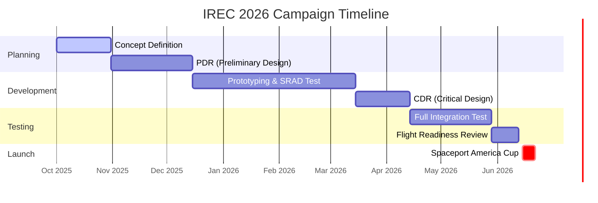

# 🚀 PROXIMA MISSION | Spaceport America Cup Repo

   

## 🌌 Mission Statement (Görev Tanımı)
**KTU Gökçen Rocket Team** is engineering the next generation of sounding rockets to compete in the world's largest intercollegiate rocket engineering conference and competition, the **Spaceport America Cup**.

Our mission is to design, build, and launch a **high-performance launch vehicle** capable of carrying a scientific payload to a target apogee, demonstrating **SRAD (Student Researched and Developed)** excellence in propulsion and avionics.

---

## 🏆 Kutsal Kase: IREC Teknik Rapor Referansları
*"Good artists copy, great artists steal." - Pablo Picasso*

Aşağıdaki raporlar, Spaceport America Cup standartlarını yakalamamız için **incelenmesi zorunlu** kaynaklardır.

### 🚀 30,000 ft (Advanced Class)
> *Complex aerodynamics, supersonic flight profiles, and multi-stage architectures.*
*   **[McGill Rocket Team - Stella II (2018)](https://www.mcgillrocketteam.com/)** - *Kompozit Gövde & Aviyonik*
*   **[Waterloo Rocketry - Kraken of the Sky (2022)](https://waterloorocketry.com/)** - *Hybrid Motor & SRAD Sistemler*
*   **[Waterloo Rocketry - Shark of the Sky (2019)](https://waterloorocketry.com/)** - *Yüksek İrtifa Tasarımı*

### 🛸 10,000 ft (Intermediate Class)
> *Precision landing, COTS propulsion mastery, and payload integration.*
*   **[McGill Rocket Team - Project Blanche (2018)](https://www.mcgillrocketteam.com/)** - *COTS Entegrasyon & Kurtarma*
*   **[Texas A&M SRT - Telemachus (2024)](https://tamusrt.org/)** - *Sentetik Açıklıklı Radar (SAR) Payload*
*   **[Texas A&M SRT - Daedalus (2017)](https://tamusrt.org/)** - *10k Hibrit Motor Başarısı*
*   **[Waterloo Rocketry - Vidar III (2017)](https://waterloorocketry.com/)** - *SRAD Hibrit Başlangıcı*

### 🧪 Experimental & SRAD Technologies
> *Pushing the envelope with custom propulsion and innovative materials.*
*   **[Waterloo Rocketry - Unexploded Ordnance (2018)](https://waterloorocketry.com/)** - *Kismet Hibrit Motor Serisi*
*   **[Clemson University - IREC 2024 Report](https://cecas.clemson.edu/rocket-engineering/)** - *Süreç Yönetimi ve Mühendislik Disiplini*
*   **[Clemson University Archives (2022-2023)](https://cecas.clemson.edu/rocket-engineering/)**

---

## 📂 Repository Structure (Repo Yapısı)
This repository is organized to mirror the **ESRA** deliverable timeline.

| Directory | Description | ESRA Deliverable |
| :--- | :--- | :--- |
| **`docs/01_Milestones_&_Updates`** | Progress updates and major design review presentations. | **PDR, CDR** |
| **`docs/02_Technical_Report`** | The "Holy Grail". Detailed documentation of every system. | **Technical Report** |
| **`docs/03_Safety_&_SRAD`** | Risk assessment, hazard analysis, and operational checklists. | **Safety Documentation** |
| **`docs/04_Subsystems_&_Payload`** | Deep dives into Avionics, Propulsion, Aerostructures, and Recovery. | **Design Documents** |
| **`analysis/`** | Python scripts (RocketPy), OpenRocket files, and CFD results. | **Flight Analysis** |

---

## 🛠️ Tech Stack & Analysis Tools

> [!TIP]
> **Simulation First:** We do not fly what we cannot simulate.

*   **Trajectory:** [OpenRocket](https://openrocket.info/), [RocketPy](https://github.com/RocketPy-Team/RocketPy)
*   **CAD/CFD:** SolidWorks, Ansys Fluent
*   **PCB Design:** Altium Designer / KiCad
*   **Programming:** Python, C++ (Embedded)

---

## 📅 Roadmap to Spaceport

## 🤝 Contributing
See `CONTRIBUTING.md` for guidelines on how to propose changes, report bugs, and submit Pull Requests. We follow a strict **"Branch per Feature"** workflow.

---
*Created with ❤️ by KTU Gökçen Rocket Team*
