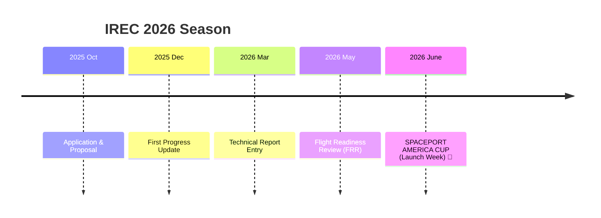

<div align="center">
  
  <br><br>
  
   <!-- Placeholder for IREC/ESRA logo if needed later -->

  # 📋 Spaceport America Cup (IREC) 2026 - Project Documentation
  ### Karadeniz Technical University - Gökçen Rocket Team

  [](https://www.soundingrocket.org/)
  [](https://github.com/bahattinyunus/ktu-rocket-irec/actions)
  [](https://www.soundingrocket.org/)
  [](LICENSE)

  <br>

  **"Engineering the future, aiming for the stars in the New Mexico desert."**

</div>

---

## 📚 Resources & References

| 🇹🇷 Local References | 🌍 IREC & International Resources |
| :--- | :--- |
| • [Gökçen Legacy Reports](pass_reports/)<br>• [Teknofest Archive](https://teknofest.org/tr/) | • **[ESRA (Exp. Sounding Rocket Assoc.)](https://www.soundingrocket.org/)**<br>• [RocketPy](https://github.com/RocketPy-Team/RocketPy)<br>• [OpenRocket](https://github.com/openrocket/openrocket)<br>• [Nakka Rocketry](https://www.nakka-rocketry.net/)<br>• [Apogee Rockets](https://www.apogeerockets.com/) |

---

> [!IMPORTANT]
> **📢 Team Announcement**
>
> 1.  **Access:** To contribute, ask for "Collaborator" access or open a Pull Request.
> 2.  **Report Analysis:** Please check `past_reports` for previous IREC technical papers.
> 3.  **Language:** Primary documentation language is **English** (IREC requirement), but internal notes can be in Turkish.

---

## 🛠️ Technology Stack
<div align="center">


</div>

---

## 📌 Repository Purpose
This repository serves as the central hub for **Karadeniz Technical University Gökçen Rocket Team**'s participation in the **2026 Spaceport America Cup (IREC)**. It contains all design documents, analysis reports, flight simulations, and avionics software codes.

---

## 🚀 About Spaceport America Cup (IREC)

The **Spaceport America Cup** is the world's largest intercollegiate rocket engineering conference and competition, held annually in New Mexico, USA.

### 🏆 Categories
Our team is targeting the following category:
*   **Target Altitude:** 10,000 ft (AGL) or 30,000 ft (AGL)
*   **Propulsion Type:** COTS (Commercial Off-The-Shelf) or SRAD (Student Researched and Developed)
*   **Current Target:** **10,000 ft - COTS Solid Motor** (Preliminary Decision)

### 📝 Timeline (IREC 2026)
The competition requires strict adherence to the ESRA timeline:



### 🎯 Scoring Criteria
*   **Project Technical Report:** 500 Points (Design correctness, analysis, safety).
*   **Flight Performance:** 500 Points (Altitude accuracy, recovery success, payload mission).
*   **Bonus:** Sportsmanship, Team Spirit, SRAD components.

---

## 📂 Documentation Structure (IREC Standard)

```plaintext
├── 📂 assets              # Images, banners, logos
├── 📂 docs                # 🧠 Technical Documentation
│   ├── 📂 esra_docs       # IREC specific documents (Rules, Updates)
│   ├── 📂 analysis        # 🧮 CFD, FEA, Trajectory Analysis
│   ├── 📂 avionics        # ⚡ Circuit diagrams, PCB layouts
│   ├── 📂 recovery        # 🪂 Parachute sizing, drift analysis
│   ├── 📂 propulsion      # 🔥 Motor selection / SRAD design
│   ├── 📂 payload         # 📦 Scientific Payload details
│   └── 📂 safety          # ⚠️ Risk Assessment & Checklists
├── 📂 flight_data         # 📡 Telemetry logs & Simulation files (OpenRocket/RasAero)
├── 📜 CITATION.cff        # Academic citation
├── 📜 README.md           # Main project file
└── 📜 LICENSE             # MIT License
```

### 📋 Key Documents
*   [🚀 Launch Operations Checklist](docs/safety/checklist_launch.md)
*   [⚠️ Risk Assessment](docs/safety/risk_assessment.md)
*   [📄 Technical Report Draft](docs/esra_docs/technical_report_draft.md)

---

## 🤝 Contributing & Workflow
1.  **Weekly Meetings:** Sundays at 20:00.
2.  **Documentation:** All engineering decisions must be documented in `docs/` with justifications.
3.  **Units:** All documents must use **Imperial & Metric** units (IREC requirement).

---

## 📞 Contact
*   **Team Lead:** [Name Surname] (email@ktu.edu.tr)
*   **Faculty Advisor:** [Title Name Surname]

<div align="center">
  <p>© 2026 Karadeniz Technical University - Gökçen Rocket Team</p>
</div>
