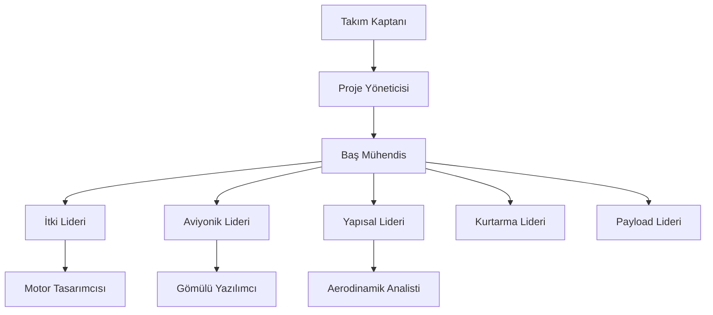

# 📂 00_Admin

## Amaç
Bu klasör takım için idari ve yönetim belgelerini içerir.

## İçerik
*   **Takım Listesi (Roster):** Üyeler, roller ve iletişim bilgileri.
*   **Bütçe:** Finansal takip, Malzeme Listesi (BOM).
*   **Lojistik:** New Mexico'ya seyahat planları, roketin kargolanması.
*   **ESRA İletişimleri:** Yarışma organizatörlerinden gelen resmi e-postalar ve güncellemeler.

## 👥 Takım Organizasyon Şeması
Profesyonel bir roket takımı hiyerarşisi:

## Önemli Aksiyonlar
- [ ] Bir "ESRA İletişim Sorumlusu" atayın (Takım Kaptanı olması önerilir).
- [ ] Tüm son teslim tarihlerini paylaşılan bir takvimde takip edin.
